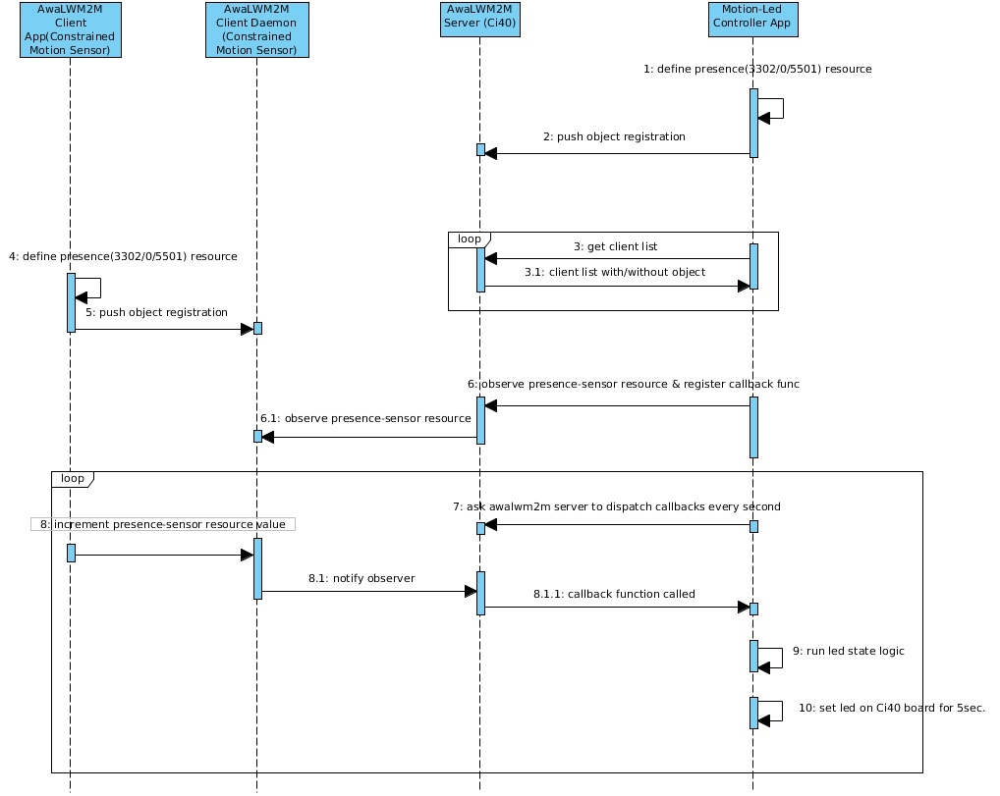

# Motion-Led Controller application

## Overview
Motion led controller application runs on Ci40 board. One MikroE board acts as awalwm2m client having a clicker which detects motion. Controller application acts as awalwm2m server and observes any changes in lwm2m object registered by client on server, and whenever there is a change, controller gets a notification for the same, and glow led for 5 seconds. 

| Object Name       | Object ID      | Resource Name       | Resource ID |
| :----             | :--------------| :-------------      | :-----------|
| "Presence Sensor" | 3302           | "IlluminanceSensor" | 5501        |

## Prerequisites
Prior to running motion led controller application, make sure that:
- Awalwm2m server daemon(awa_serverd) is running.
- Awalwm2m bootstrap daemon(awa_bootstrapd) is running.

**NOTE:** Please do "ps" on console to see "specific" process is running or not.

## Application flow diagram


## API guide

Motion-Led Controller documentation is available as a Doxygen presentation which is generated via the following process.

  1. Install [Doxygen ](http://www.stack.nl/~dimitri/doxygen/download.html): ```` sudo apt-get install doxygen````
  2. Generate the documentation:

        $ motion-led-controller: mkdir build
        $ motion-led-controller/build: cd build
        $ motion-led-controller/build: cmake ../docs
        $ motion-led-controller/build: make docs

The output can be found in the build/html directory and viewed by opening index.html with your web browser.

## Using OpenWrt SDK to build standalone package

Please refer [OpenWrt-SDK-build-instructions](https://github.com/CreatorKit/openwrt-ckt-feeds#building-creatorkit-packages-using-pre-compiled-openwrt-sdk-for-ci40-marduk) for exact build instructions.


## Running Application on Ci40 board
Motion-Led Controller Application is getting started as a daemon. Although we could also start it from the command line as :

*$ motion_led_controller_appd*

Output looks something similar to this :
```
Motion-Led Controller Application

------------------------


Establish server session for port:54321 and address:127.0.0.1

Server session established


Defining IlluminanceSensor[3302] object on awalwm2m server

Waiting for constrained device 'MotionSensorDevice' to be up

Constrained device MotionSensorDevice registered

Successfully added observe operation for sensor object[3302/0/5501]


Received observe callback for sensor object[3302/0/5501] with value 1

Sensor state has changed

Turn ON led on Ci40 board

Turn OFF led on Ci40 board

Received observe callback for sensor object[3302/0/5501] with value 2

Sensor state has changed

Turn ON led on Ci40 board

Turn OFF led on Ci40 board
```
